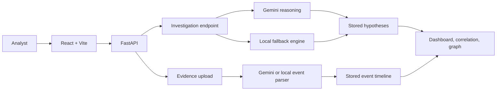

# Black Box Investigator

Black Box Investigator is an evidence-first incident investigation platform. It accepts incident artifacts, extracts structured events, builds a timeline, generates competing hypotheses, and maps evidence to possible causes.

The application combines Gemini reasoning with a deterministic local fallback, so an investigation can still complete when Gemini is unavailable or quota-limited.

## Features

- Upload logs, traces, reports, and other evidence
- Extract structured incident events
- Review a chronological event timeline
- Generate competing investigation hypotheses
- Display confidence, reasoning, and evidence relationships
- Compare supporting and contradicting evidence
- Explore evidence-to-hypothesis correlation
- View an investigation relationship graph
- Track incident severity and investigation status
- Navigate Dashboard, Incidents, Timeline, Evidence, and Investigation pages
- Handle loading, empty, upload, connection, and API error states

## Architecture



## Investigation Workflow

1. Upload evidence for `INC-001`.
2. The backend extracts structured events and stores them on the incident.
3. The frontend refreshes the timeline.
4. Run the investigation.
5. The backend tries Gemini once and falls back locally when needed.
6. Hypotheses are stored and returned with their source.
7. The frontend reloads the persisted investigation and timeline.

The `GET /investigation` endpoint reads stored results. Generation is triggered by `POST /investigate`, not by a read request.

## Technology

### Frontend

- React
- Vite
- React Router
- JavaScript and JSX
- Normal CSS

### Backend

- Python
- FastAPI
- Uvicorn
- Pydantic
- In-memory incident store

### Reasoning and parsing

- Google Gemini API
- Local event parser fallback
- Local deterministic hypothesis engine

## Project Structure

```text
black-box-investigator/
├── backend/
│   ├── app/
│   │   ├── api/incidents.py
│   │   ├── core/config.py
│   │   ├── models/schemas.py
│   │   ├── services/
│   │   │   ├── hypothesis.py
│   │   │   ├── investigation.py
│   │   │   ├── local_hypothesis.py
│   │   │   ├── parser.py
│   │   │   ├── reasoning.py
│   │   │   ├── store.py
│   │   │   └── timeline.py
│   │   └── main.py
│   ├── requirements.txt
├── frontend/
│   ├── src/
│   │   ├── components/
│   │   │   ├── BackendStatus.jsx
│   │   │   ├── CorrelationView.jsx
│   │   │   ├── EvidenceUpload.jsx
│   │   │   ├── HypothesisCard.jsx
│   │   │   ├── IncidentSummary.jsx
│   │   │   ├── InvestigationGraph.jsx
│   │   │   ├── Sidebar.jsx
│   │   │   ├── Timeline.jsx
│   │   │   ├── TimelineEvent.jsx
│   │   │   └── Topbar.jsx
│   │   ├── pages/
│   │   │   ├── Dashboard.jsx
│   │   │   ├── Evidence.jsx
│   │   │   ├── Incidents.jsx
│   │   │   ├── Investigation.jsx
│   │   │   └── TimelinePage.jsx
│   │   ├── services/api.js
│   │   ├── App.jsx
│   │   ├── index.css
│   │   └── main.jsx
│   └── package.json
├── sample_data/incident_001/server.log
└── README.md
```

## API

The API uses the incident ID `INC-001` in the example commands below.

### Health check

```http
GET /health
```

Response:

```json
{"status": "healthy"}
```

### Upload evidence

```http
POST /incidents/{incident_id}/evidence
Content-Type: multipart/form-data
```

The upload field is named `file`. The response includes the evidence ID, file type, processing status, extracted text, and extracted events.

### Get timeline

```http
GET /incidents/{incident_id}/timeline
```

Returns the stored events sorted chronologically.

### Run investigation

```http
POST /incidents/{incident_id}/investigate
```

This triggers hypothesis generation and stores the results. The response includes:

```json
{
  "incident_id": "INC-001",
  "status": "investigation_complete",
  "source": "local",
  "hypotheses": []
}
```

The `source` value is `gemini` when Gemini generated the results and `local` when the fallback engine was used.

### Get stored investigation

```http
GET /incidents/{incident_id}/investigation
```

Returns the stored timeline, hypotheses, and evidence relationships. It does not start a new Gemini request.

## Configuration

Create `frontend/.env`:

```env
VITE_API_URL=http://127.0.0.1:8000
```

Create `backend/.env` with your Gemini credential:

```env
GEMINI_API_KEY=your_gemini_api_key
```

Keep credentials out of source control. Restart Vite after changing frontend environment variables.

## Run Locally

### Backend

From the repository root, open a terminal:

```powershell
cd backend
python -m venv .venv
.\.venv\Scripts\Activate.ps1
pip install -r requirements.txt
python -m uvicorn app.main:app --reload
```

Backend URLs:

- API: http://127.0.0.1:8000
- Swagger UI: http://127.0.0.1:8000/docs
- Health: http://127.0.0.1:8000/health

### Frontend

Open a second terminal:

```powershell
cd frontend
npm install
npm.cmd run dev
```

Vite normally serves the app at http://localhost:5173. If that port is occupied, use the URL printed in the terminal.

## Try the Sample Incident

1. Start both services.
2. Open the frontend URL.
3. Open the Evidence page.
4. Upload `sample_data/incident_001/server.log`.
5. Confirm the timeline contains 9 extracted events.
6. Open Investigation or click Investigate incident.
7. Confirm H1, H2, and H3 appear.
8. If Gemini quota is exhausted, confirm the UI reports `Local fallback`.
9. Open the correlation and investigation graph sections on the dashboard.

The sample log describes deployment activity, database migration and latency, connection timeout, API failures, payment unavailability, and service recovery.

## Gemini Fallback

The backend attempts Gemini reasoning during `POST /investigate`. If Gemini fails because of quota, availability, or another request error, the local hypothesis engine generates deterministic results instead.

The frontend treats this as a successful investigation. It displays `Local fallback` rather than claiming Gemini was used.

Typical local hypotheses include:

- **H1:** Database performance or migration issue
- **H2:** Application defect introduced during deployment
- **H3:** Independent infrastructure degradation

These are competing explanations, not an automatic declaration of root cause.

## Development Checks

Run the frontend checks from `frontend/`:

```powershell
npm.cmd run lint
npm.cmd run build
```

## Current Limitations

- Incident data is stored in memory and resets when the backend restarts.
- The current UI focuses on the default incident `INC-001`.
- Authentication and authorization are not implemented.
- Evidence files are stored locally in `backend/uploads/`.
- The Gemini API requires a configured key and available quota.

## License

This project is intended for educational, portfolio, and engineering demonstration purposes.
