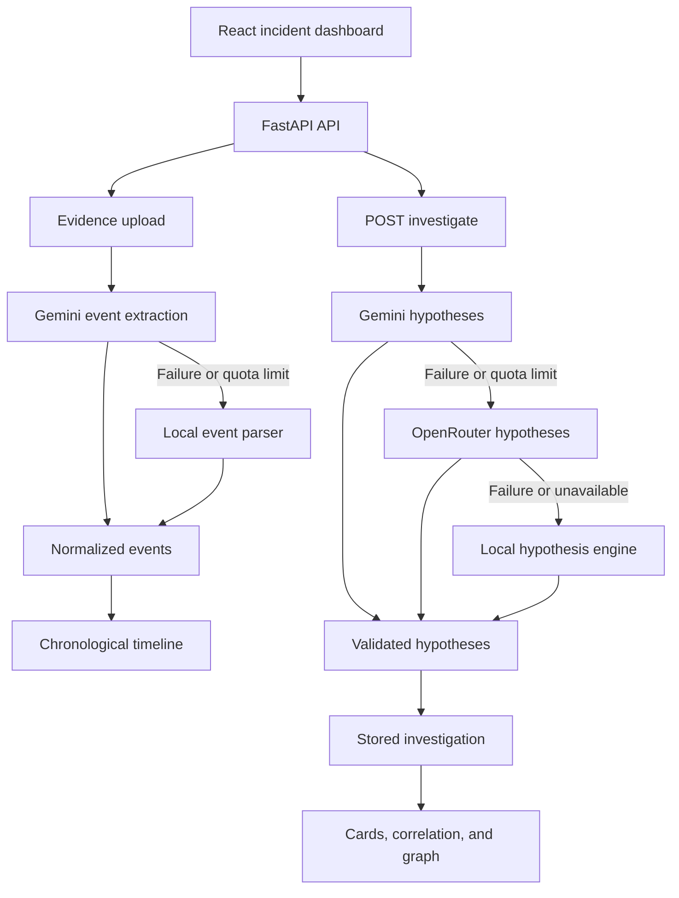

# Black Box Investigator

Black Box Investigator is an AI-powered incident investigation and root-cause analysis platform. It helps incident responders analyze logs and application events, reconstruct an incident timeline, and compare competing hypotheses with supporting, contradicting, and missing evidence.

The goal is not simply to produce an answer. The platform shows why a hypothesis is plausible and what additional evidence is needed to confirm it.

## Live Demo

- Frontend: https://black-box-investigator.vercel.app
- Backend API: https://black-box-investigator-api.onrender.com
- Swagger UI: https://black-box-investigator-api.onrender.com/docs
- Health check: https://black-box-investigator-api.onrender.com/health

## What It Does

Black Box Investigator follows an evidence-first workflow:

1. Upload incident evidence.
2. Extract structured events from the evidence.
3. Build a chronological incident timeline.
4. Analyze relationships between events.
5. Generate competing root-cause hypotheses.
6. Link hypotheses to supporting evidence.
7. Identify contradicting or missing evidence.
8. Present the results through an incident-response dashboard.

## Features

### Evidence ingestion

- Upload `.log`, `.txt`, `.csv`, `.json`, and `.md` files
- Automatic file-type detection
- Text extraction from uploaded evidence
- Evidence storage against an incident
- Processing status and extracted event counts

### AI event extraction

- Gemini-powered structured event extraction
- Local parser fallback for unavailable or quota-limited AI requests
- Timestamp preservation
- Event type classification
- Severity classification
- Evidence-to-event relationships

Example event:

```json
{
  "event_id": "53cde695-81c5-4503-b3a9-5d1353449b3b",
  "timestamp": "2026-08-21T09:41:02Z",
  "source": "server.log",
  "event": "Deployment completed successfully",
  "type": "deployment",
  "severity": "info"
}
```

### Incident timeline

Events are normalized and sorted chronologically to reconstruct the incident sequence.

```text
Deployment completed
        |
Database migration started
        |
Database migration completed
        |
Database latency increased
        |
Database connection timeout
        |
API 500 errors
        |
Payment service unavailable
```

### AI-assisted investigation

The investigation engine generates multiple competing hypotheses instead of assuming one root cause. Each hypothesis can contain:

- Confidence score
- Reasoning
- Supporting evidence
- Contradicting evidence
- Evidence required to confirm the hypothesis

### Correlation and graph views

The dashboard connects timeline events to hypotheses through:

- Evidence-to-hypothesis correlation cards
- Supporting and contradicting relationship labels
- Confidence indicators
- Investigation relationship graph

### Local fallback reasoning

The system remains usable when an AI provider is unavailable or quota-limited. The deterministic fallback engine can identify patterns involving:

- Database failures
- Deployments
- Application failures
- Infrastructure degradation
- Network problems

## AI Architecture



The provider order for hypothesis generation is:

```text
Gemini -> OpenRouter -> Local fallback
```

The `GET /investigation` endpoint only reads stored results. It does not start another AI request.

## Technology Stack

### Frontend

- React
- Vite
- JavaScript and JSX
- CSS
- React Router

### Backend

- Python
- FastAPI
- Uvicorn
- Pydantic
- Python Multipart
- Requests

### AI and reasoning

- Google Gemini API
- OpenRouter API
- Local event parser
- Local deterministic hypothesis engine

### Deployment

- Vercel for the frontend
- Render for the backend

## Project Structure

```text
black-box-investigator/
├── backend/
│   ├── app/
│   │   ├── agents/
│   │   ├── api/
│   │   │   └── incidents.py
│   │   ├── core/
│   │   │   └── config.py
│   │   ├── models/
│   │   │   └── schemas.py
│   │   ├── services/
│   │   │   ├── hypothesis.py
│   │   │   ├── investigation.py
│   │   │   ├── local_hypothesis.py
│   │   │   ├── parser.py
│   │   │   ├── reasoning.py
│   │   │   ├── store.py
│   │   │   └── timeline.py
│   │   └── main.py
│   ├── requirements.txt
│   └── uploads/
├── frontend/
│   ├── src/
│   │   ├── components/
│   │   │   ├── BackendStatus.jsx
│   │   │   ├── CorrelationView.jsx
│   │   │   ├── EvidenceUpload.jsx
│   │   │   ├── HypothesisCard.jsx
│   │   │   ├── IncidentSummary.jsx
│   │   │   ├── InvestigationGraph.jsx
│   │   │   ├── Sidebar.jsx
│   │   │   ├── Timeline.jsx
│   │   │   ├── TimelineEvent.jsx
│   │   │   └── Topbar.jsx
│   │   ├── pages/
│   │   │   ├── Dashboard.jsx
│   │   │   ├── Evidence.jsx
│   │   │   ├── Incidents.jsx
│   │   │   ├── Investigation.jsx
│   │   │   └── TimelinePage.jsx
│   │   ├── services/
│   │   │   └── api.js
│   │   ├── App.jsx
│   │   ├── index.css
│   │   └── main.jsx
│   └── package.json
├── sample_data/
│   ├── database_migration.log
│   ├── deployment_failure.log
│   ├── network_instability.log
│   ├── payment_service.log
│   ├── security_incident.log
│   └── incident_001/server.log
├── docs/
└── README.md
```

Environment files are intentionally excluded from the project tree and should not be committed.

## API Endpoints

All examples use the default incident ID `INC-001`.

### Health check

```http
GET /health
```

### Upload evidence

```http
POST /incidents/{incident_id}/evidence
Content-Type: multipart/form-data
```

The multipart field is named `file`. The response includes the evidence ID, file type, processing status, extracted text, and extracted events.

### Get timeline

```http
GET /incidents/{incident_id}/timeline
```

Returns stored events sorted chronologically.

### Run investigation

```http
POST /incidents/{incident_id}/investigate
```

Attempts Gemini, then OpenRouter, then the local fallback engine. The response reports which provider succeeded:

```json
{
  "incident_id": "INC-001",
  "status": "investigation_complete",
  "source": "local",
  "hypotheses": []
}
```

Possible `source` values are `gemini`, `openrouter`, and `local`.

### Get stored investigation

```http
GET /incidents/{incident_id}/investigation
```

Returns stored timeline, hypotheses, and evidence relationships. This endpoint is read-only and does not invoke an AI provider.

## Sample Data

The repository includes sample logs for different incident scenarios:

- `database_migration.log`: migration, latency, timeout, API failures, and payment failure
- `deployment_failure.log`: deployment, application latency, timeout, failure, and rollback
- `network_instability.log`: network latency, packet loss, database timeout, and recovery
- `payment_service.log`: payment latency, API timeout, HTTP 500, outage, and recovery
- `security_incident.log`: failed authentication, suspicious login activity, rate limiting, and blocking
- `incident_001/server.log`: the default end-to-end sample incident

To test the default incident, upload:

```text
sample_data/incident_001/server.log
```

The default log produces 9 structured events with the local parser.

## Running Locally

### Backend

From the repository root:

```powershell
cd backend
python -m venv .venv
.\.venv\Scripts\Activate.ps1
pip install -r requirements.txt
python -m uvicorn app.main:app --reload
```

Backend URLs:

- API: http://127.0.0.1:8000
- Swagger UI: http://127.0.0.1:8000/docs
- Health check: http://127.0.0.1:8000/health

Create `backend/.env` locally:

```env
GEMINI_API_KEY=your_gemini_api_key
OPENROUTER_API_KEY=your_openrouter_api_key
```

### Frontend

Open a second terminal:

```powershell
cd frontend
npm install
npm.cmd run dev
```

Create `frontend/.env` locally:

```env
VITE_API_URL=http://127.0.0.1:8000
```

Vite normally serves the frontend at http://localhost:5173. If that port is occupied, use the URL printed in the terminal.

Restart Vite after changing environment variables.

## Try the Application

1. Start the backend and frontend.
2. Open the frontend URL.
3. Open the Evidence page.
4. Upload `sample_data/incident_001/server.log`.
5. Confirm the timeline shows 9 events.
6. Open Investigation or click **Investigate incident**.
7. Confirm H1, H2, and H3 are displayed.
8. If Gemini quota is exhausted, confirm the UI reports **Local fallback**.
9. Review the evidence correlation and investigation graph on the dashboard.

## Deployment

### Backend on Render

Service URL:

```text
https://black-box-investigator-api.onrender.com
```

Start command:

```text
python -m uvicorn app.main:app --host 0.0.0.0 --port $PORT
```

Required Render environment variables:

```env
GEMINI_API_KEY=your_gemini_api_key
OPENROUTER_API_KEY=your_openrouter_api_key
```

### Frontend on Vercel

Service URL:

```text
https://black-box-investigator.vercel.app
```

Vercel environment variable:

```env
VITE_API_URL=https://black-box-investigator-api.onrender.com
```

Vite embeds environment variables at build time, so redeploy after changing this value.

## CORS

The backend allows local development origins and the deployed Vercel frontend origin. Keep the deployed frontend URL synchronized with the backend CORS configuration.

## Development Checks

Run from `frontend/`:

```powershell
npm.cmd run lint
npm.cmd run build
```

## Current Limitations

- Incident data is stored in memory and resets when the backend restarts.
- The current UI focuses on the default incident `INC-001`.
- Authentication and authorization are not implemented.
- Uploaded evidence is stored locally in `backend/uploads/`.
- AI providers require configured credentials and available quota.

## Future Improvements

- PostgreSQL persistence
- Multiple incident case management
- PDF, image, and screenshot evidence extraction
- Git commit and deployment correlation
- Network and infrastructure telemetry integrations
- Advanced interactive graph visualization
- Human-in-the-loop investigation workflow
- Authentication and role-based access control
- Investigation history and collaboration

## Author

Lovesh Roy  
B.Tech Computer Science & Engineering  
Lovely Professional University

## License

This project is intended for educational, experimental, and portfolio purposes.
